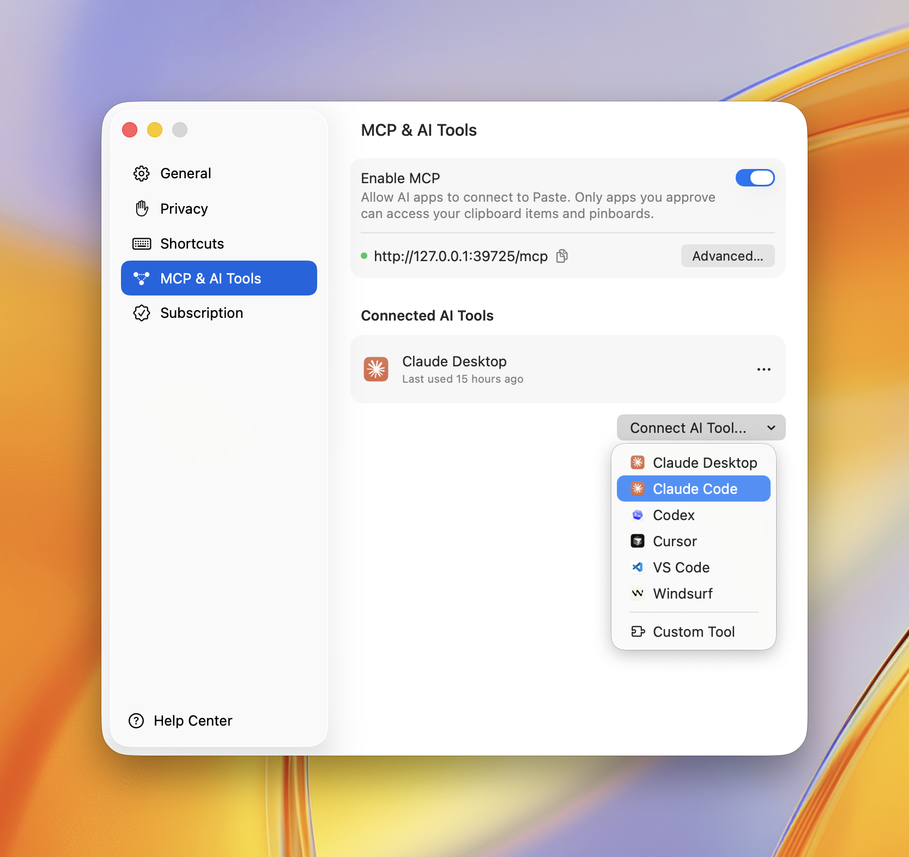

# Paste MCP

[](https://www.npmjs.com/package/@pasteapp/mcp)
[](https://www.npmjs.com/package/@pasteapp/mcp)
[](LICENSE)

**Local MCP server for [Paste](https://pasteapp.io).** Give Claude, Codex, Cursor, and other AI tools access to your Mac's clipboard history and pinboards — without anything leaving your device.

Your assistant can search your clipboard items, pull one into context, or save its output to a pinboard.

## Install

Use [`add-mcp`](https://www.npmjs.com/package/add-mcp) to connect Paste to all your installed AI apps:

```bash
npx add-mcp @pasteapp/mcp
```

The first time an app uses Paste, it'll ask you to authenticate and allow access.

Alternatively, connect Paste to each app manually:

### Claude Code

```bash
claude mcp add paste -- npx -y @pasteapp/mcp
```

### Codex

```bash
codex mcp add paste -- npx -y @pasteapp/mcp
```

### Cursor

[](https://cursor.com/en/install-mcp?name=paste&config=eyJjb21tYW5kIjoibnB4IiwiYXJncyI6WyIteSIsIkBwYXN0ZWFwcC9tY3AiXX0%3D)

### VS Code

[](https://insiders.vscode.dev/redirect/mcp/install?name=paste&config=%7B%22command%22%3A%22npx%22%2C%22args%22%3A%5B%22-y%22%2C%22%40pasteapp%2Fmcp%22%5D%7D)

### Connect from Paste

You can also connect any app right inside Paste. Open **Settings → MCP & AI Tools**, click **Connect AI Tool**, and choose your app — Paste does the rest.



## Privacy Policy

Paste MCP runs locally on your Mac — it bridges your AI app to Paste's on-device server and sends nothing to Paste's own servers. Your clipboard items only reach the AI apps you approve, and you can revoke access anytime in **Settings → MCP & AI Tools**.

Full policy — what data is processed, how it's stored, sharing, retention, and contact: **https://pasteapp.io/privacy**.

## Troubleshooting

**The AI tool says Paste isn't available.**
Make sure Paste is running and **MCP is enabled** in Settings → MCP & AI Tools.

**Tools don't show up after connecting.**
Fully quit and reopen your AI app so it relaunches the server.

**`npx` errors or "command not found".**
Confirm Node.js 18+ is installed: `node --version`.

## Requirements

- **macOS** with **[Paste](https://pasteapp.io) 6.6+**, and **MCP enabled** in Settings → MCP & AI Tools
- **[Node.js](https://nodejs.org) 18+**

## Contributing

Issues and pull requests welcome — see [the issue tracker](https://github.com/pasteapp/paste-mcp/issues).

## License

[MIT](LICENSE) © [Paste Team ApS](https://pasteapp.io)
